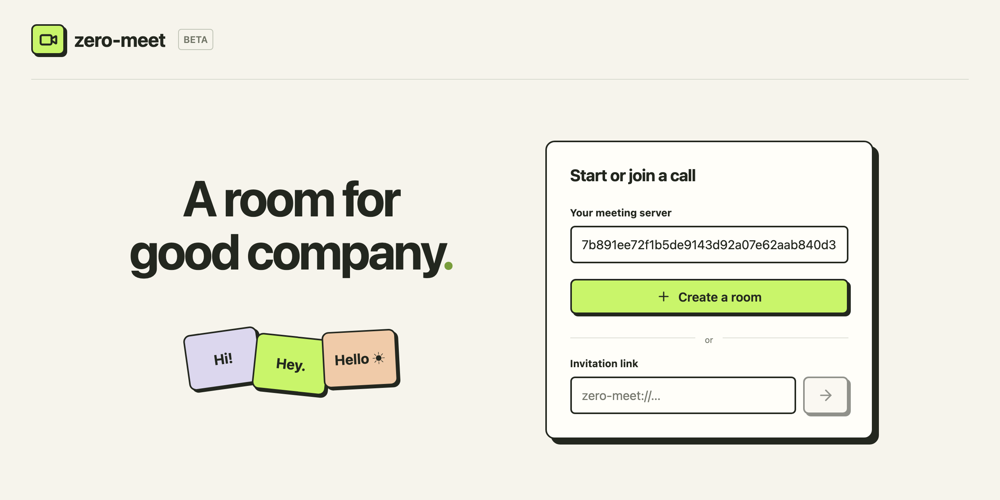
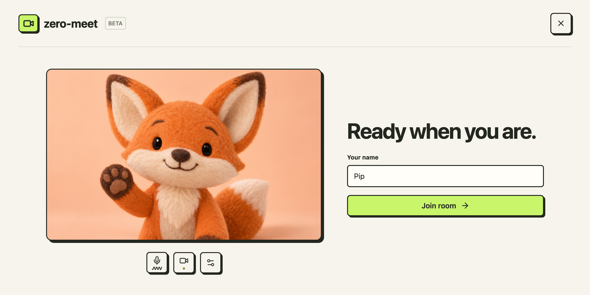

# zero-meet

Zero-fuss video calls on a server you can run. No accounts. No port-forwarding.


> No animals were harmed during the making of this screenshot

Built on [iroh](https://github.com/n0-computer/iroh) ❤️

## Installation

Requires macOS 15 (Sequoia) or later. Download the universal `.dmg` from [releases](https://github.com/orangetin/iroh-meet/releases) or [build it yourself](#build-the-mac-installer).

## Start or join a call

### 1. Open a room

- **Start:** Paste a server address → **Create a room**.
- **Join:** Paste an invitation link → click the arrow.

Get a server address from your host, or [host your own](#host-a-meeting-server).



### 2. Get ready

Enter your name, check your camera and microphone, and click **Join room**.



### 3. You're in

Click **Invite** to copy a link for others.

## Host a meeting server

> [!TIP]
> No port forwarding, reverse proxy, DNS, or TLS certificates to configure. Start the server with Docker Compose and share its address.

You will need [docker with compose](https://docs.docker.com/compose/install/) setup on a machine that stays online.

From the repository root, run:

```sh
docker compose up --build -d
docker compose logs -f server
```

The server prints a `Server address:` to the output. Copy and share that with your users.

## Build the Mac installer

Requires macOS 15 (Sequoia) or later. Install Nix and Apple's Command Line Tools:

```sh
curl -L https://nixos.org/nix/install | sh -s -- --daemon --yes
xcode-select --install
```

Reopen your terminal. From the repository root:

```sh
nix --extra-experimental-features 'nix-command flakes' \
    develop --command sh \
    -c 'cd app && npm ci && npm run tauri build'
```

Open the `.dmg` in `target/release/bundle/dmg/` and drag-to-install.
