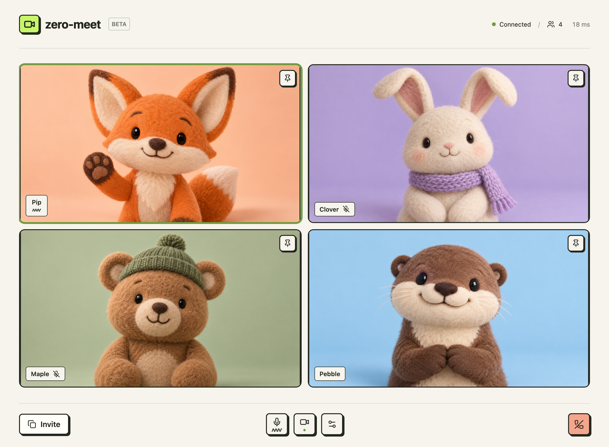
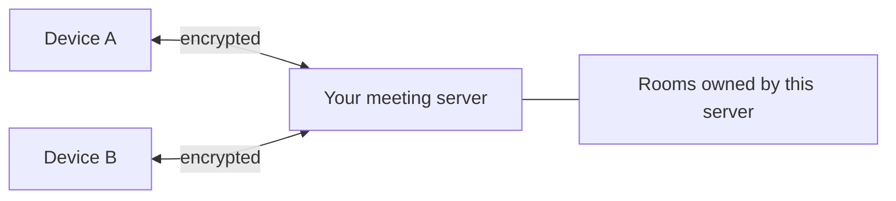

# zero-meet

Zero-fuss video calls on a server you can run. No accounts. No port-forwarding.



> This is a screenshot of the macOS desktop app. No animals were harmed during the making of this screenshot. The webcam feeds were mocked with static images.

## Installation

Requires macOS 15 (Sequoia) or later. Download the universal `.dmg` from [releases](https://github.com/orangetin/iroh-meet/releases) or [build it yourself](#build-the-mac-installer).

## Start a call

1. Paste your server address into `Your meeting server`. Get it from your preferred server's host, or [host your own](#host-a-meeting-server).
2. Click `Create a room` -> enter your name -> `Join room`
3. Click `Invite` to copy the meeting invite link to share with others

FYI:
- Guests need the app and your invitation to join.
- Invitations contain the server identity and a room key.
- An empty room expires after ten minutes.

## Join a call

1. Copy the invitation your host sent you, and paste it into `Invitation link` in the app.
2. Enter your name and choose whether to turn on your camera and microphone.
3. Click `Join room`.

# Host a meeting server

> [!TIP]
> No port forwarding, reverse proxy, DNS, or TLS certificates to configure. Start the server with Docker Compose and share its address.

You will need [docker with compose](https://docs.docker.com/compose/install/) setup on a machine that stays online.

From the repository root, run:

```sh
docker compose up --build -d
docker compose logs -f server
```

The server prints a `Server address:` to the output. Copy and share that with your users.

## How it works



Connections are encrypted between devices and the server.

# Build the Mac installer

Requires macOS 15 (Sequoia) or later. Install Nix and Apple's Command Line Tools:

```sh
curl -L https://nixos.org/nix/install | sh -s -- --daemon --yes
xcode-select --install
```

Reopen your terminal. From the repository root:

```sh
nix --extra-experimental-features 'nix-command flakes' \
    develop --command sh \
    -c 'cd app && npm ci && npm run tauri build'
```

Open the `.dmg` in `target/release/bundle/dmg/` and drag-to-install.
